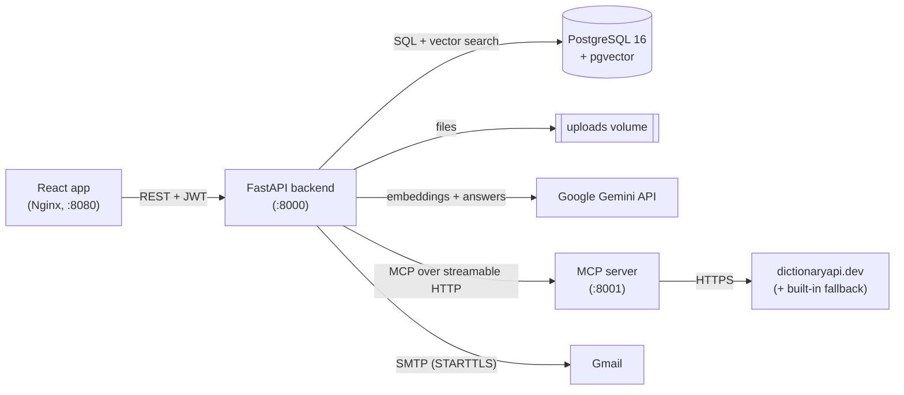

# PDF Chat Platform

Upload a PDF and ask questions about it. Answers come **only** from the document's text
(retrieval-augmented generation with Google Gemini and PostgreSQL + pgvector), and a small
**MCP server** gives the chatbot a dictionary tool for "What does *X* mean?" questions.

Users sign up with email verification (6-digit OTP sent through Gmail SMTP), log in with
JWT authentication, manage their profile and password, and only ever see their own PDFs
and chats.

## Features

- **Accounts:** sign up, email OTP verification, login, profile view/update, change password,
  forgot/reset password with an emailed OTP, and logout that revokes every issued token.
- **PDFs:** upload one or more files at once, with validation (extension, content type, `%PDF` signature, size).
  Text is extracted page by page, chunked and embedded. You can list, select, and delete your files.
- **Chat:** questions are embedded and matched against the selected PDF's chunks (top 5, cosine
  similarity). Gemini answers from those excerpts only. When the answer isn't there it replies exactly
  *"I could not find this information in the selected document."* Every question and answer is saved.
- **MCP tool:** `get_word_definition(word)` on a separate MCP server (streamable HTTP). The backend
  lists the server's tools, gives them to Gemini, runs the calls Gemini requests and returns the results.
  Answers that used the tool show a **Used dictionary tool** badge.
- **Everything in Docker:** `docker compose up --build` starts the database, MCP server, backend and frontend.

## Architecture



**Upload:** validate → save the file under a random name → `processing` → (background) extract text
per page → chunks of ~1000 characters with 150 overlap → Gemini embeddings (768 dimensions) → store in
`document_chunks` → `ready` (or `failed` with a clear message).

**Question:** embed the question → pgvector search limited to *your* user id **and** the selected document
→ top 5 chunks + question + MCP tool list to Gemini → run any requested tool on the MCP server → final
answer → saved in `chat_messages`.

The backend follows **router → service → database**. Routers only handle HTTP, services hold the logic and
raise `AppError` subclasses, and a global handler turns those into `{"detail": "..."}` responses.

## Tech stack

| Layer | Technology |
|---|---|
| Frontend | React 19 (Vite, JavaScript), React Router, Axios, served by Nginx |
| Backend | FastAPI, Pydantic v2, SQLAlchemy 2.0, Alembic, PyJWT, pwdlib (Argon2), pypdf |
| Database | PostgreSQL 16 + pgvector 0.8 (`pgvector/pgvector:pg16`), HNSW cosine index |
| AI | Google Gemini via `google-genai`: `gemini-3.8-flash` (answers, with fallback models when overloaded), `gemini-embedding-001` (768-dim embeddings) |
| MCP | Official MCP Python SDK (v1, `FastMCP`), streamable HTTP transport |
| Email | Gmail SMTP with an App Password |
| Infra | Docker, Docker Compose |

## Project structure

```
backend/
  app/
    auth/           signup, verify email, login, logout, forgot/reset password, get_current_user
    users/          profile (GET/PATCH /me), change password
    emails/         SMTP sending, email templates, OTP creation/verification
    documents/      upload validation, file storage, PDF extraction + chunking, list/get/delete
    embeddings/     Gemini embeddings (batched, normalized)
    vector_search/  pgvector similarity search filtered by user and document
    llm/            Gemini client, RAG prompt, tool-calling loop
    mcp_client/     connects to the MCP server: list tools, call tools
    chat/           ask a question, chat history
    models/         SQLAlchemy models (one file per table group)
    core/           settings, database, security (hashing, OTP HMAC, JWT), errors, shared fields
  alembic/          database migrations
  tests/            pytest suite (uses a separate test database)
  scripts/          send_test_email.py (checks your Gmail setup)
frontend/
  src/api/          one function per endpoint, shared Axios instance
  src/pages/        Signup, VerifyEmail, Login, ForgotPassword, ResetPassword, Profile, Dashboard, Chat
  src/components/   Layout, route guards, form field, upload section, status badge
  src/context/      AuthProvider (token, current user, auto-logout)
mcp_server/         FastMCP server with get_word_definition (+ local_dictionary.json fallback)
docs/               ER diagram, plain-language explanation
docker-compose.yml
.env.example
```

## Setup

### 1. Prerequisites

- Docker Desktop (includes Docker Compose v2)
- A Gmail account with **2-Step Verification** enabled
- A Google Gemini API key

### 2. Gmail App Password

The backend sends OTP emails through Gmail SMTP. Gmail does not accept your normal password for this;
you need an **App Password**. Never put your real Gmail password in any file.

1. Turn on 2-Step Verification: Google Account → **Security** → **2-Step Verification**.
2. Open <https://myaccount.google.com/apppasswords> (or search "App passwords" in your Google Account).
3. Enter a name such as `PDF Chat Platform` and click **Create**.
4. Copy the 16-character password **without spaces** into `SMTP_PASSWORD` in `.env`.
5. Put your Gmail address in `SMTP_USERNAME` and `SMTP_FROM_EMAIL`.

Optional check, run outside Docker from `backend/` with the virtual environment active:
`python -m scripts.send_test_email you@example.com`

### 3. Gemini API key

Create a key at <https://aistudio.google.com/apikey> and put it in `GEMINI_API_KEY`.

### 4. Environment variables

```bash
cp .env.example .env      # Windows PowerShell: Copy-Item .env.example .env
```

Then edit `.env`. `.env` is git-ignored; `.env.example` contains placeholders only.

| Variable | Purpose |
|---|---|
| `CORS_ORIGINS` | JSON list of frontend origins allowed to call the API (includes `http://localhost:8080` for Docker and `http://localhost:5173` for Vite dev) |
| `VITE_API_URL` | Backend address **as seen from the browser**; baked into the frontend at build time |
| `POSTGRES_USER`, `POSTGRES_PASSWORD`, `POSTGRES_DB` | Database credentials (the container creates this database on first start) |
| `POSTGRES_PORT` | Port published on your machine (default 5433) |
| `DATABASE_URL` | Only for running the backend outside Docker; Compose overrides it |
| `OTP_SECRET_KEY` | HMAC key for hashing OTPs (32+ random characters) |
| `OTP_EXPIRE_MINUTES`, `OTP_MAX_ATTEMPTS`, `OTP_RESEND_COOLDOWN_SECONDS` | OTP lifetime, wrong-guess limit, resend cooldown |
| `JWT_SECRET_KEY`, `JWT_ALGORITHM`, `ACCESS_TOKEN_EXPIRE_MINUTES` | Signing key (different from the OTP key), algorithm and token lifetime |
| `SMTP_HOST`, `SMTP_PORT`, `SMTP_USERNAME`, `SMTP_PASSWORD`, `SMTP_FROM_EMAIL`, `SMTP_FROM_NAME` | Gmail SMTP settings (App Password!) |
| `GEMINI_API_KEY` | Google Gemini API key |
| `GEMINI_CHAT_MODEL`, `GEMINI_EMBEDDING_MODEL`, `GEMINI_TEMPERATURE` | Models and answer temperature (default 0.2) |
| `GEMINI_FALLBACK_MODELS` | JSON list of models tried when the chat model is overloaded (default `["gemini-3.6-flash","gemini-3.5-flash-lite"]`) |
| `MAX_UPLOAD_SIZE_MB`, `MAX_FILES_PER_UPLOAD` | Upload limits (defaults 20 MB, 10 files) |
| `MCP_SERVER_URL` | MCP endpoint (outside Docker `http://localhost:8001/mcp`; Compose sets `http://mcp:8001/mcp`) |

Generate the two secret keys with:
`python -c "import secrets; print(secrets.token_urlsafe(32))"` (run it twice).

## Run with Docker

```bash
docker compose up --build
```

| Service | URL |
|---|---|
| Frontend | <http://localhost:8080> |
| Backend API + Swagger UI | <http://localhost:8000/docs> |
| MCP server | `http://localhost:8001/mcp` (for MCP clients, not a web page) |
| PostgreSQL | `localhost:5433` |

Startup order is handled by healthchecks: `db` → `mcp` → `backend` (runs `alembic upgrade head`, then
uvicorn) → `frontend`. Uploaded PDFs live in the `uploads` volume and data in `postgres_data`.
`docker compose down` keeps both; `docker compose down -v` deletes them.

In Swagger, log in with `POST /api/auth/login`, click **Authorize**, and paste the `access_token`.

## Run locally (development)

```bash
docker compose up -d db mcp                       # database + MCP server in Docker

cd backend
python -m venv .venv && .venv\Scripts\activate    # macOS/Linux: source .venv/bin/activate
pip install -r requirements-dev.txt
alembic upgrade head
uvicorn app.main:app --reload                     # http://localhost:8000

cd ../frontend
npm install
npm run dev                                       # http://localhost:5173
```

## Tests

```bash
# Backend: needs the database container running. Uses a separate "pdfchat_test" database
# (create it once: docker compose exec db createdb -U <POSTGRES_USER> pdfchat_test).
# Gmail, Gemini and the MCP server are replaced by fakes.
cd backend && python -m pytest

# MCP server tool logic
cd mcp_server && python -m pytest

# Frontend lint + production build
cd frontend && npm run lint && npm run build
```

## API overview

All endpoints except auth and health need `Authorization: Bearer <token>`.
Another user's document always returns **404**.

| Method | Path | Description |
|---|---|---|
| POST | `/api/auth/signup` | Create account, email a verification code |
| POST | `/api/auth/verify-email` | Verify email with the 6-digit code |
| POST | `/api/auth/resend-verification` | New verification code (same response for unknown emails) |
| POST | `/api/auth/login` | Get a JWT (403 if the email isn't verified) |
| POST | `/api/auth/logout` | Revoke all of the user's tokens |
| POST | `/api/auth/forgot-password` | Email a reset code (same response for unknown emails) |
| POST | `/api/auth/reset-password` | Set a new password with the code |
| GET | `/api/users/me` | Current user's profile |
| PATCH | `/api/users/me` | Update name |
| POST | `/api/users/me/change-password` | Change password; returns a new token |
| POST | `/api/documents` | Upload one or more PDFs (multipart field `files`) → 202 |
| GET | `/api/documents` | List your documents |
| GET | `/api/documents/{id}` | One document (poll until `ready`) |
| DELETE | `/api/documents/{id}` | Delete document, chunks, chat history and file |
| POST | `/api/documents/{id}/chat` | Ask a question → saved answer (`used_tool` flag) |
| GET | `/api/documents/{id}/messages` | Chat history, oldest first |
| GET | `/api/health` | Database connectivity check |

## Demo walkthrough

1. **Start:** `docker compose up --build`, wait until all four services are running, open <http://localhost:8080>.
2. **Register:** *Sign up* with name, email, password.
3. **Verify:** enter the 6-digit code from your inbox (resend is available after 60 s).
4. **Log in** with the verified account.
5. **Update the profile:** open your name in the navigation bar, change it, **Save changes**.
6. **Forgot password:** log out → *Forgot your password?* → enter the email → enter the emailed code and a
   new password → log in with the new password.
7. **Upload a PDF** on the dashboard. The status goes from *Processing* to *Ready*.
8. **Ask two questions** the PDF answers: click **Chat** and ask, for example, about its main topic and a specific detail.
9. **Ask an unanswerable question**, e.g. "What is the capital of France?", and get exactly
   *"I could not find this information in the selected document."*
10. **MCP tool:** ask "What does authentication mean?". The answer shows the **Used dictionary tool** badge,
    and `docker compose logs mcp` shows the `get_word_definition` call.

Reload the chat page to show that history is loaded from the database.

## Security notes

- Passwords are hashed with Argon2. OTPs are stored as HMAC-SHA256 hashes, expire after 10 minutes,
  are single-use, and are limited to 5 wrong attempts.
- JWTs carry a `tv` (token version). Logout, password change and password reset increase it, so old tokens stop working.
- "Send me a code" endpoints return the same response whether or not the email exists. Login takes the
  same time for unknown emails and wrong passwords.
- Every query on documents, chunks and chats filters by the logged-in user's id.
- Uploaded files get random names, and the original name is never used as a path.
- Secrets live only in `.env` (git-ignored). The containers run as non-root users.

## Troubleshooting

| Symptom | Fix |
|---|---|
| No OTP email | Check spam; verify `SMTP_*` values and the App Password; see `docker compose logs backend` |
| Document shows *Failed* with "AI service is not configured" | Set `GEMINI_API_KEY` in `.env`, then `docker compose up -d backend` |
| Chat says "The AI service could not answer right now" | Gemini returned 503/429 on every model (high demand). Wait a minute and retry; `docker compose logs backend` shows the retries and model switches |
| "No text could be extracted" | The PDF is a scanned image; only text-based PDFs are supported (no OCR) |
| Definition comes from "built-in technical dictionary" | dictionaryapi.dev was unreachable (it returned Cloudflare 522 errors during testing); the MCP server fell back to its local list after an 8 s timeout |
| Browser shows CORS / network errors | Make sure `CORS_ORIGINS` contains the exact frontend origin and `VITE_API_URL` is the backend address, then rebuild |
| Port already in use | Change the left side of the port mapping in `docker-compose.yml` (or `POSTGRES_PORT`) |
