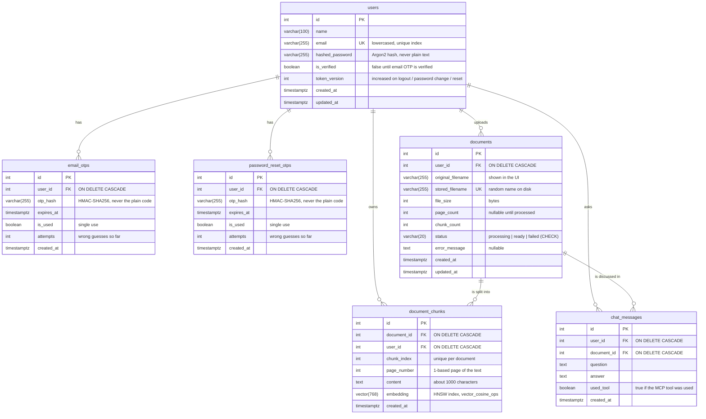

# Database schema (ER diagram)

PostgreSQL 16 with the `pgvector` extension. Every table is created by Alembic
migrations in `backend/alembic/versions/`.

## Relationships

| Relationship | Type | On delete |
|---|---|---|
| users → email_otps | one-to-many | deleting a user deletes their codes |
| users → password_reset_otps | one-to-many | deleting a user deletes their codes |
| users → documents | one-to-many | deleting a user deletes their documents |
| documents → document_chunks | one-to-many | deleting a document deletes its chunks |
| documents → chat_messages | one-to-many | deleting a document deletes its chat history |
| users → document_chunks, chat_messages | one-to-many | also stored directly, so every query can filter by owner |

## Indexes

| Table | Index | Purpose |
|---|---|---|
| users | `ix_users_email` (unique) | fast login lookup; one account per email |
| email_otps / password_reset_otps | `user_id` | find a user's newest code |
| documents | `user_id`, unique `stored_filename` | list a user's documents |
| document_chunks | `ix_document_chunks_embedding_hnsw` (HNSW, cosine) | fast nearest-neighbour vector search |
| document_chunks | `document_id`, `user_id`, unique `(document_id, chunk_index)` | filter search to one user's document |
| chat_messages | `(document_id, created_at)`, `user_id` | load a document's history in order |
